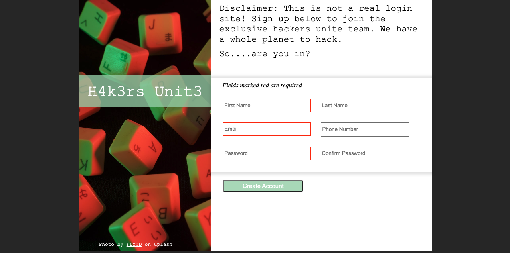

## Sign Up Form 

## Overview
I created a custom sign-up form with vanilla HTML/CSS. The purpose of this project is to learn form styling and validation checks

## Lessons Learned 
- Used Grid to create a custom layout of the webpage
- Used pseudo-classes to create the required functionality in css
- Manipulated form attributes to provide clean ux 
- Used form attributes to provide some level of input validation

## Potential Improvements 
- Implement JS to add layer of validation checks for password fields

